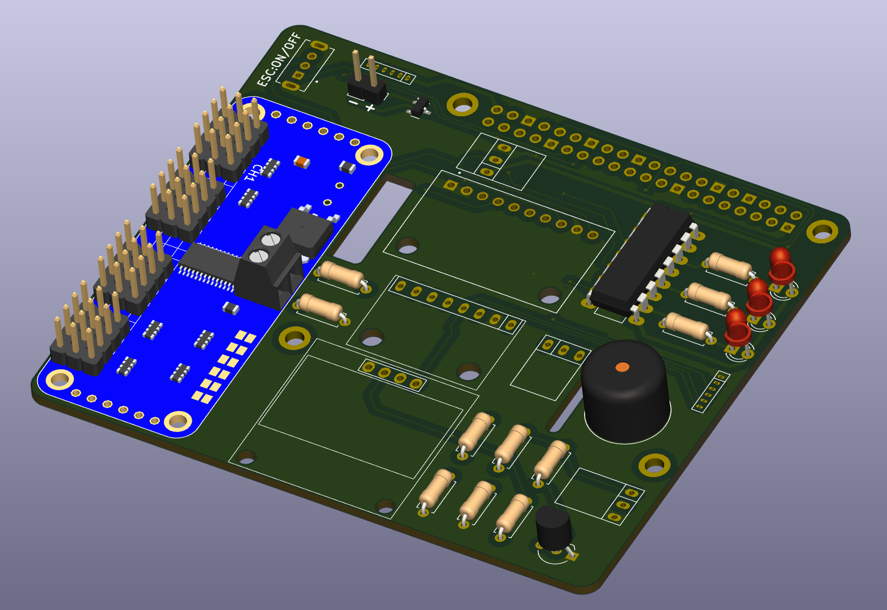

# Welcome to the OBAL_V2 Wiki

Welcome to the official OBAL_V2 github page! 🚀

OBAL_V2 is a next-generation automation platform designed to streamline and simplify the configuration of Raspberry Pi-based systems for Ardupilot, Pi Camera, and more. This platform takes advantage of modern Linux capabilities and offers an easy-to-use Python script to automatically configure your system for optimal performance.

Whether you're a developer, hobbyist, or a drone enthusiast, OBAL_V2 is designed to help you easily set up and run your systems with minimal effort. Our goal is to provide you with the tools you need to succeed in your projects, whether it's automating flight controllers, working with IMUs, or streaming live video from your Pi Camera.

### Why OBAL_V2?  
- **64-bit Architecture** 🏎️ - Faster and more efficient than previous versions.  
- **Automated Setup** ⚙️ - No manual kernel tweaking; everything is configured via script.  
- **Multi-Sensor Support** 📡 - Works with multiple IMUs, GPS modules, and ADCs.  
- **AI & Computer Vision Ready** 🤖 - With the powerful Raspberry Pi 4, the **Pi Camera Module 3** can be leveraged for AI-based applications such as object detection, autonomous navigation, and real-time video analysis.  
- **Affordable & Open-Source** 💡 - A high-performance alternative to expensive, proprietary flight controllers.  

Feel free to explore the various setup guides, troubleshooting tips, and features that OBAL_V2 offers. If you have any questions or suggestions, don't hesitate to reach out—we're here to help you make the most of your experience with OBAL_V2!

Check out the [OBAL_V2 Wiki](https://github.com/akhodeir/OBAL_V2/wiki) for all the details.

Note: The board/project is not limited to Ardupilot. It can be used with any other flight controller such as PX4, INAV, Betaflight, your own flight controler,...etc

Happy building! 🚁✨

# OBAL vs OBAL_V2 vs Navio2 - Comparison

## 🚀 Overview
This table outlines the **significant improvements** made from the initial **OBAL** to **OBAL_V2** and compares it with the **Navio2** flight controller system.

---

## ⚙️ **Feature Comparison**

| Feature                | OBAL          | OBAL_V2        | Navio2             |
|------------------------|---------------|----------------|--------------------|
| **Linux Kernel**        | Bulleyes      | Bookworm       | Raspbian + ROS     |
| **Ardupilot**           | 32-bit        | 64-bit         | ?                  |
| **Linux Configuration** | Manual        | Automatic via script | Manual        |
| **Rx Protocol**         | PPM/PWM           | IBUS and SBUS  | PPM and SBUS       |
| **Flight Controller**   | Prototype     | Complete system| Complete system    |
| **IMU**                 | GY-91         | GY-91, GY-912, ... + more | MPU9250, LSM9DS1 |
| **Display**             | No            | Yes            | No                 |
| **Power Module**        | No            | Yes            | Yes                |
| **License**             | Open source   | Open source    | Proprietary        |
| **Price**               | < $60         | < $60          | $199               |
| **Link**                | [here](https://github.com/HefnySco/OBAL)     | [here](#)      | [here](https://navio2.hipi.io/)        |

---

## ⚠️ **Cons with Initial OBAL:**
- Uses **analog Rx protocol (PPM) or (PWM)**, limiting flexibility.
- Limited to **GY-91 IMU** (only possible IMU).
- **Safety switch** is not well designed.
- No proper **logic conversion** (mix of **5V and 3.3V** logical levels with Raspberry Pi).
- Uses an **old Linux version**, requiring recompilation to disable **`CONFIG_STRICT_DEVMEM`**.
- **32-bit Ardupilot** applications limit performance.

---
## [Donation] Your support is invaluable to this project!

Countless hours of hard work, prototyping, and investment in tools and materials have gone into making this project a reality. If you appreciate the effort and would like to contribute, your donation will help us continue developing and improving OBAL_V2.

Please consider donating for the project. There were tremendous effort added in this project. 
Many prototype boards were built and a lot of tools were purchased to make this project become true.

click image below to start donating :

**Important**

Use this project at your own risk. 
